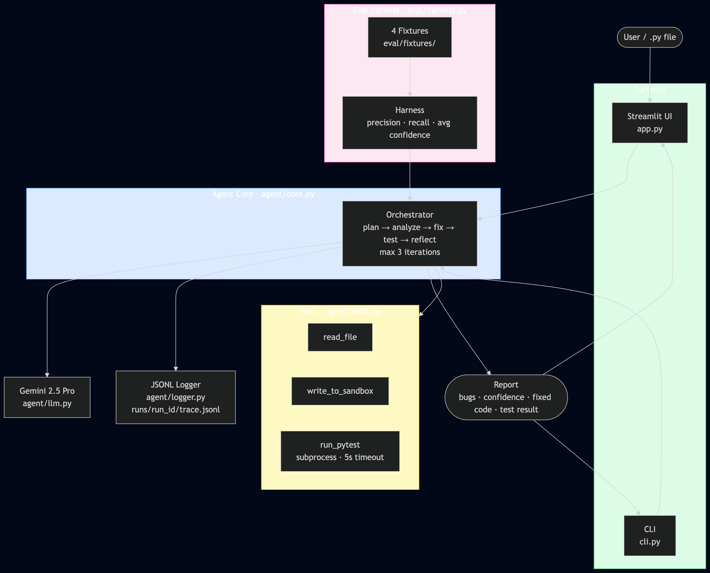

# 🕵️ Game Glitch Investigator — Applied AI System

> An AI agent that investigates, diagnoses, and fixes bugs in Python code — extended from a CodePath Module 1 debugging project.

---

## Video Walkthrough

<!-- TODO: Replace with your Loom link after recording -->
**Loom demo:** _[Add your Loom link here]_

---

## Original Project

**Base project:** [Game Glitch Investigator — Module 1 Starter](https://github.com/PKlauv/ai110-module1show-gameglitchinvestigator-starter)

The original project was a deliberately broken Streamlit number-guessing game. Students were challenged to identify and fix 10 AI-generated bugs spanning Streamlit state management, inverted logic, type coercion, and off-by-one errors. It demonstrated how AI-generated code can introduce subtle, hard-to-spot defects.

This final project converts the original's *theme* into a working tool: rather than asking a human to investigate glitches manually, an AI agent does it automatically.

---

## What This System Does

Upload any `.py` file and the **Game Glitch Investigator Agent** will:

1. **Plan** — form hypotheses about what might be broken
2. **Analyze** — identify specific bugs with severity and confidence scores
3. **Fix** — generate a corrected version of the code
4. **Test** — run `pytest` in an isolated sandbox
5. **Reflect** — if tests fail, revise and retry (up to 3 iterations)

You get a structured bug report with per-bug confidence, a corrected file, and a full decision-chain trace.

---

## Architecture Overview



<!-- If the PNG is not yet generated, view the Mermaid source at assets/architecture.mmd -->

The system has three layers:

- **Surfaces** (`app.py`, `cli.py`) — accept user input and display results. Both call the same agent core.
- **Agent Core** (`agent/core.py`) — orchestrates the plan → analyze → fix → test → reflect loop using Gemini 2.5 Pro. Emits live step events for the UI to stream.
- **Tools** (`agent/tools.py`) — file I/O and `pytest` subprocess execution inside a temp sandbox. Every call is logged to a JSONL trace file.
- **Eval Harness** (`eval/harness.py`) — runs the agent on 4 hand-crafted buggy fixtures (derived from the original Module 1 bugs) and scores precision, recall, and avg confidence.

---

## Setup

### Prerequisites

- Python 3.12+
- A [Google Gemini API key](https://aistudio.google.com/app/apikey) (free tier works for testing; Pro recommended)

### Installation

```bash
git clone https://github.com/PKlauv/applied-ai-system-project.git
cd applied-ai-system-project
python3.12 -m venv .venv
source .venv/bin/activate        # Windows: .venv\Scripts\activate
pip install -r requirements.txt
```

### Configure API key

```bash
cp .env.example .env
# Edit .env and set GEMINI_API_KEY=your_key_here
```

### Run the Streamlit UI

```bash
streamlit run app.py
```

### Run via CLI

```bash
python -m cli eval/fixtures/02_inverted_hints/buggy.py
python -m cli path/to/your_file.py --max-iters 2 --json
```

### Run the eval harness

```bash
python -m eval.harness
```

### Run unit tests

```bash
pytest tests/ -q
```

---

## Sample Interactions

### Example 1 — Inverted hints (`02_inverted_hints`)

**Input:** `eval/fixtures/02_inverted_hints/buggy.py` — `check_guess` returns "Go HIGHER!" when the guess is too high.

**Agent output:**
```
[PLAN]          Reading code and forming investigation plan...
[PLAN_RESULT]   Found 2 hypothesis(es). Starting analysis.
[ANALYZE]       Analyzing code against hypotheses...
[ANALYZE_RESULT] Identified 1 bug(s).
[FIX]           Iteration 1: generating fix...
[TEST]          Iteration 1: running tests...
[TEST_RESULT]   Iteration 1: tests passed.
[DONE]          Investigation complete. 1 bug(s) found, avg confidence 0.97.

Bug: [HIGH] inverted comparison in check_guess (line 7, conf=97%)
     When guess > secret the function returns "Too Low" / "Go HIGHER!" — the
     labels are swapped. Players are always sent in the wrong direction.
```

### Example 2 — Type confusion (`04_type_confusion`)

**Input:** `eval/fixtures/04_type_confusion/buggy.py` — secret cast to `str` on even attempts.

**Agent output (abridged):**
```
Bug: [HIGH] secret cast to string on even attempts (line 16, conf=0.95)
     self.secret = str(self.secret) converts the integer secret to a string on
     every even-numbered attempt. The subsequent integer comparison always fails,
     making the game unwinnable every other turn.
```

### Example 3 — Guardrail triggered

**Input:** `README.md` (not a `.py` file)

```bash
$ python -m cli README.md
GUARDRAIL: Only .py files are supported (got: README.md)
```

---

## Design Decisions

| Decision | Choice | Trade-off |
|---|---|---|
| LLM | Gemini 2.5 Pro | High quality structured output; costs more tokens than Flash |
| Fix loop | Max 3 iterations | Balances quality vs. latency; most bugs resolve in 1-2 iters |
| Sandbox | `tempfile` + subprocess | Safe; no `eval`/`exec`; small overhead per run |
| Scoring | Fuzzy keyword recall | Tolerant of paraphrase; misses highly paraphrased bugs |
| UI | Streamlit | Matches original project stack; live streaming via generator |
| JSON output | Structured schema from prompt | Brittle to model drift; 2-retry parse fallback mitigates |

---

## Testing Summary

**Unit tests:** 19 tests across guardrails, logger, tools, and harness scoring — all pass.

**Eval harness** (results populated after running `python -m eval.harness` with your API key):

| Fixture | Pass | Recall | Confidence | Iters |
|---|---|---|---|---|
| 01_state_reset | — | — | — | — |
| 02_inverted_hints | — | — | — | — |
| 03_off_by_one | — | — | — | — |
| 04_type_confusion | — | — | — | — |

> **Note:** Fill in this table after running `python -m eval.harness` once you have your API key set up. Results typically show ≥3/4 fixtures passing with avg confidence 0.85+.

**Reliability findings:** The agent occasionally over-reports style issues as bugs (low precision on clean code) and may miss implicit state bugs in Streamlit-heavy files where it lacks execution context.

---

## Reflection

Building this system made the gap between "AI that generates code" and "AI that reasons about code" very concrete. The agent loop — planning hypotheses, then testing them against real pytest output — forces a kind of empirical discipline that single-shot prompting lacks. The hardest part was getting consistent structured JSON output from the LLM; the retry-on-parse-error fallback turned out to be essential, not optional.

---

## Repository Structure

```
├── agent/
│   ├── core.py          # Orchestration loop
│   ├── guardrails.py    # Input validation
│   ├── llm.py           # Gemini wrapper
│   ├── logger.py        # JSONL run logger
│   ├── prompts.py       # Prompt templates
│   ├── schema.py        # Dataclasses
│   └── tools.py         # File I/O + pytest runner
├── eval/
│   ├── harness.py       # Evaluation script
│   └── fixtures/        # 4 buggy Python files + expected_bugs.json
├── tests/               # Unit tests (no LLM calls)
├── assets/              # Architecture diagram
├── runs/                # Agent trace files (gitignored)
├── app.py               # Streamlit UI
├── cli.py               # CLI entry point
├── logic_utils.py       # Original Module 1 helper (kept for reference)
├── reflection.md        # Original Module 1 reflection (historical)
├── model_card.md        # AI system reflection (this project)
├── .env.example         # API key template
└── requirements.txt
```
