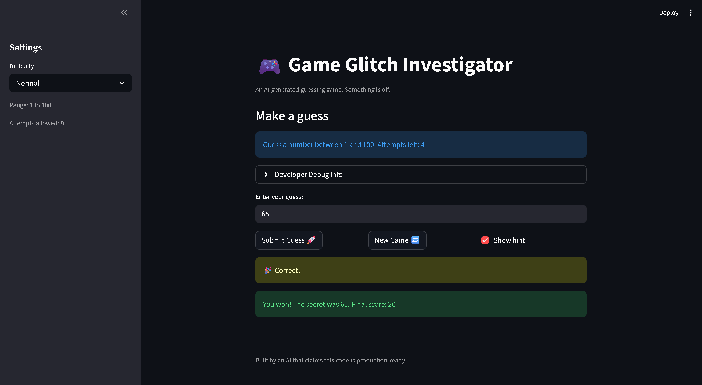

# 🎮 Game Glitch Investigator: The Impossible Guesser

## 🚨 The Situation

You asked an AI to build a simple "Number Guessing Game" using Streamlit.
It wrote the code, ran away, and now the game is unplayable.

- You can't win.
- The hints lie to you.
- The secret number seems to have commitment issues.

## 🛠️ Setup

1. Install dependencies: `pip install -r requirements.txt`
2. Run the broken app: `python -m streamlit run app.py`

## 🕵️‍♂️ Your Mission

1. **Play the game.** Open the "Developer Debug Info" tab in the app to see the secret number. Try to win.
2. **Find the State Bug.** Why does the secret number change every time you click "Submit"? Ask ChatGPT: *"How do I keep a variable from resetting in Streamlit when I click a button?"*
3. **Fix the Logic.** The hints ("Higher/Lower") are wrong. Fix them.
4. **Refactor & Test.** - Move the logic into `logic_utils.py`.
   - Run `pytest` in your terminal.
   - Keep fixing until all tests pass!

## 🎯 Game Description

This is a number guessing game built with Streamlit. The player picks a difficulty (Easy, Normal, or Hard), and the game generates a random secret number within the corresponding range. The player guesses numbers and receives hints ("Go HIGHER!" or "Go LOWER!") until they find the secret or run out of attempts. A scoring system rewards fewer guesses and penalizes wrong ones.

## 🐛 Bugs Found & Fixes Applied

1. **Hints were backwards** — `check_guess` returned "Go HIGHER!" when the guess was too high. Fixed by swapping the hint messages.
2. **Secret number changed type on even attempts** — code converted the secret to a string on even-numbered attempts, breaking integer comparison and making the game unwinnable. Fixed by removing the type-conversion block entirely.
3. **UI hardcoded "between 1 and 100"** — the info message always said 1-100 regardless of difficulty. Fixed by using the actual `low` and `high` variables.
4. **Hard mode range was 1-50** (easier than Normal's 1-100). Fixed by changing Hard to 1-200.
5. **Asymmetric scoring** — "Too High" on even attempts gave +5 points instead of -5. Fixed by making both outcomes consistently deduct 5 points.
6. **New Game hardcoded range to 1-100** — ignored the current difficulty setting. Fixed by using `random.randint(low, high)`.
7. **`logic_utils.py` was all stubs** — every function raised `NotImplementedError`. Implemented all four functions with the corrected logic.
8. **Tests expected wrong return type** — tests compared `check_guess` result to a string, but it returns a tuple `(outcome, message)`. Fixed tests to unpack the tuple.
9. **Attempts started at 1** instead of 0, wasting one attempt. Fixed by initializing to 0.
10. **New Game didn't fully reset state** — score, status, and history weren't cleared. Fixed by resetting all session state fields.

## 📸 Demo

- 

## 🚀 Stretch Features

- [ ] [If you choose to complete Challenge 4, insert a screenshot of your Enhanced Game UI here]
