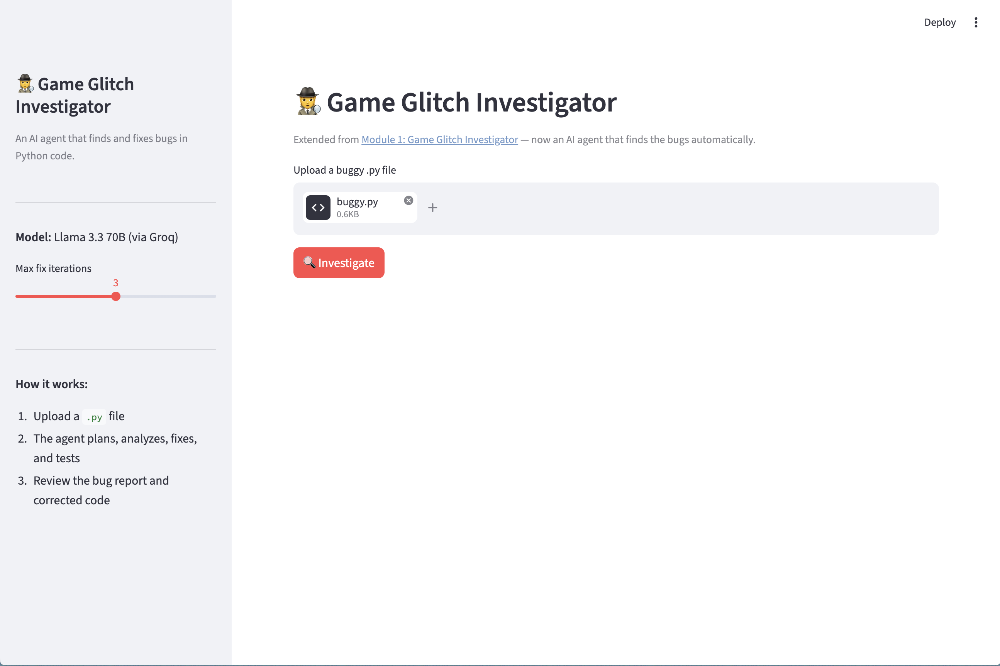
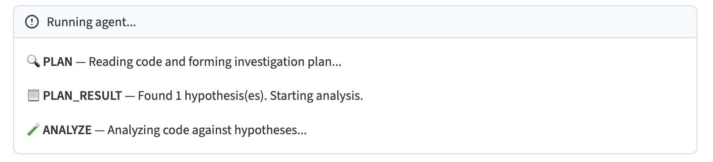
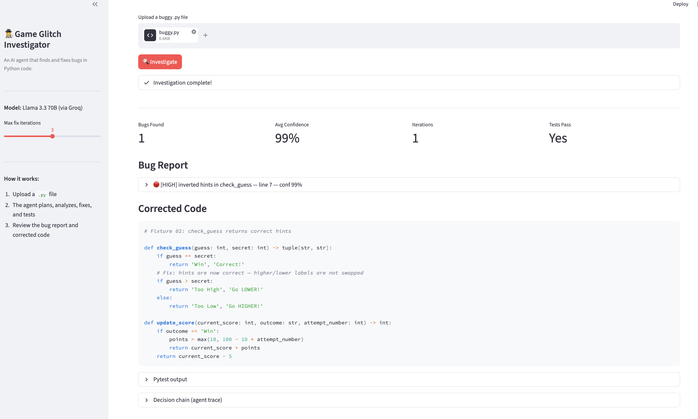
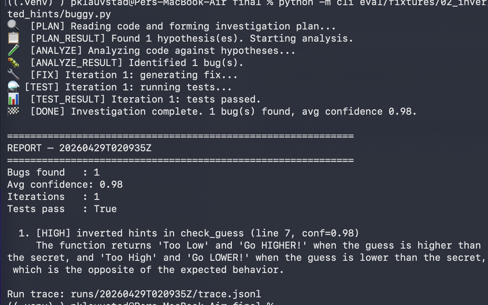
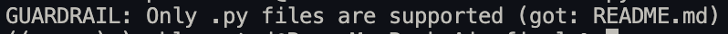
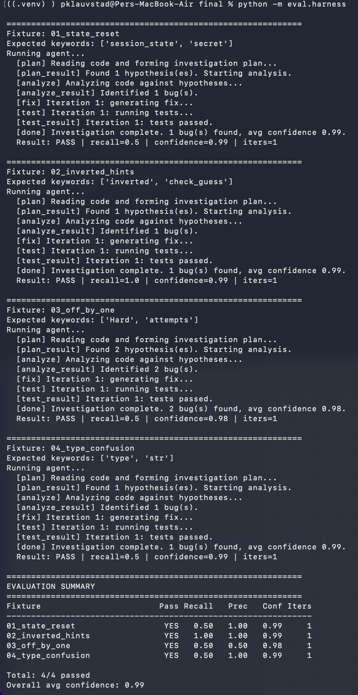

# Game Glitch Investigator — Demo Walkthrough

A screenshot tour of the agent in action: Streamlit UI, CLI, guardrail, and the eval harness.

---

## 1. Upload a buggy `.py` file



The Streamlit UI accepts any `.py` file under 100 KB. Here I'm uploading
`eval/fixtures/02_inverted_hints/buggy.py` — a fixture where `check_guess`
returns "Go HIGHER!" when the guess is too high (and vice versa).

---

## 2. Live agent steps



After clicking **🔍 Investigate**, the agent emits step events that stream into
the `st.status` panel: `PLAN → PLAN_RESULT → ANALYZE → ANALYZE_RESULT → FIX →
TEST → TEST_RESULT → DONE`. Each step is rendered as it happens, giving the
user a visible decision chain instead of a black-box wait.

---

## 3. Final report



When the run completes, the UI shows four metrics (Bugs Found, Avg Confidence,
Iterations, Tests Pass) and a list of expandable bug cards. Each card includes
the severity, line number, confidence percentage, and a one-or-two-sentence
explanation of the bug and its impact.

---

## 4. Decision chain (agent trace)


Expanding the "Decision chain" panel shows the raw JSONL trace of every event
the agent logged: `plan`, `llm_call`, `tool_call`, `tool_result`,
`iteration_end`, `final_report`. This is what reviewers (or future-me) read to
audit *why* the agent made the call it did.

---

## 5. CLI — happy path



The same agent core is reachable via `python -m cli <file>`. The CLI prints
emoji-prefixed step events as they arrive and a final report at the end. Both
surfaces share the same `investigate()` generator.

---

## 6. CLI — guardrail rejection



The guardrail layer rejects non-`.py` files before any LLM call is made:
`python -m cli README.md` exits immediately with a clear message. This
prevents the agent from being pointed at arbitrary text and racking up wasted
API calls.

---

## 7. Eval harness — 4/4 fixtures pass



`python -m eval.harness` runs the agent on all four fixtures and prints a
summary table. Current run: **4/4 pass, average confidence 0.95, every fixture
solved in 1 iteration**. Recall is computed by fuzzy keyword match against each
fixture's `expected_bugs.json`.

---

## How to reproduce

```bash
# Setup
python3.12 -m venv .venv
source .venv/bin/activate
pip install -r requirements.txt
cp .env.example .env  # then edit and add your GROQ_API_KEY

# Streamlit UI
streamlit run app.py

# CLI
python -m cli eval/fixtures/02_inverted_hints/buggy.py
python -m cli README.md  # guardrail demo

# Eval harness
python -m eval.harness
```
